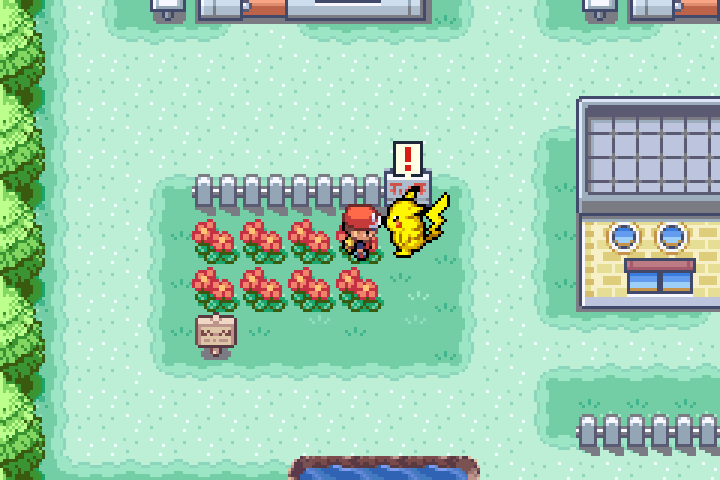
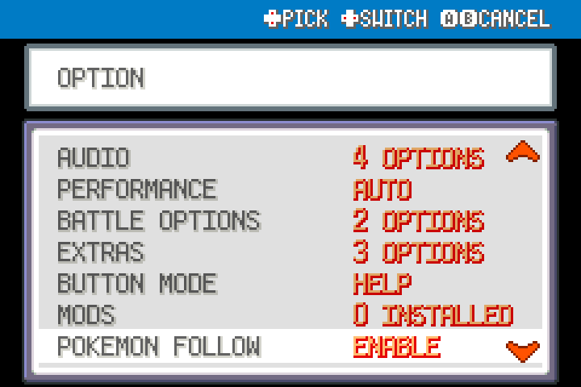
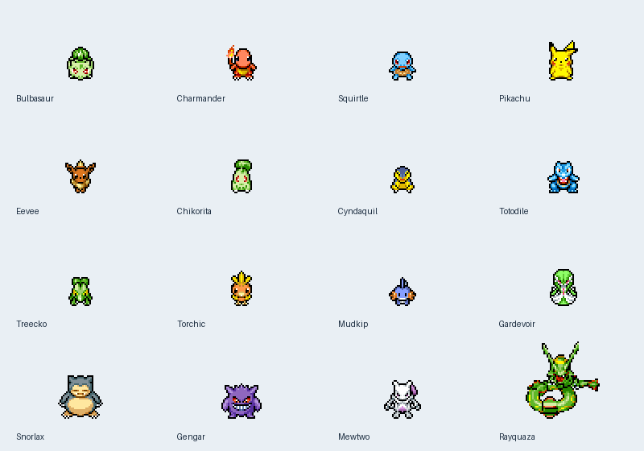

# FireRed Companion

**Your first party Pokemon, by your side.** A standalone FireRed Recomp mod with animated companions, conversations, and occasional gifts.

[Download the latest release](https://github.com/TheOriginalDrJ/FireRed-Companion/releases/latest)

## Features

- The Pokemon in party slot one follows you—even when fainted.
- Continuous following across connected route borders, preserving movement and animation.
- Face your companion and press **A** to talk or receive a gift.
- Occasional item discoveries, with an **!** bubble when a gift is ready.
- **Options → POKEMON FOLLOW → ENABLE / DISABLE**.
- Gifts and walking progress persist with your normal game save. A full Bag keeps the gift waiting.
- All 386 Gen 1–3 species are mapped to Red Rescue Team art. The asset collection contains 423 sprite sets and 93,591 poses, including alternate forms and special actors.

## Install

1. Download **PokemonCompanion-FireRed-v0.1.2.zip** from [Releases](https://github.com/TheOriginalDrJ/FireRed-Companion/releases).
2. Import the ZIP through FireRed Recomp's mod manager.
3. Enable **Pokemon Companion** and restart Recomp.
4. Set **POKEMON FOLLOW** to **ENABLE** in Options.

Replace an older version rather than enabling two copies. No new save or companion mod dependency is required. Requires a compatible FireRed Recomp engine with API 2, game3 follower/PMD modules, and engine-internals permission. A ROM and the game engine are not included.

## Companions and gifts

Reorder your party to change your companion. Eggs, an empty party, or unsupported species produce no follower. A fainted leader continues following without being healed.

Every 256 eligible walking steps gives a 25% chance to find a Potion, Antidote, Poke Ball, or Paralyze Heal. One gift can wait per Pokemon; speak to that companion to collect it. Its progress and gift are stored with your game save. Options are stored separately by the engine.

## Current limitations

- Companions temporarily withdraw during cycling, Surf, Fly, and hidden-player sequences. Doors and teleports regroup them; connected walking routes retain a continuous trail.
- Original PMD palettes are used, including for shiny party Pokemon. Unown follows its personality-selected form; Deoxys uses FireRed's Attack form; Castform uses its normal overworld form.
- Another mod taking ownership of the same follower slot may conflict.
- The specific Hoenn Route 124/125 pair and every third-party rendering pipeline have not been playtested.
- The artwork includes all extracted poses, while current gameplay uses walk/standing animations. Portraits, PMD story dialogue, dungeon AI, hunger and IQ are not implemented.

## Source and data

`companion.lua`, `main.lua`, and `manifest.json` are the runtime source. `assets.zip` contains the mod's asset directory: PNG atlases, animation sequences/timing/offsets, opaque pose bounds, original monster records, decoded monster data, source metadata, and PNG hashes. Run **`python build.py`** to assemble an installable ZIP from these files; Python's standard library is sufficient.

The source art was extracted from Red Rescue Team USA/Australia, MD5 `2100cf6f17e12cd34f1513647dfa506b`, using FireRed Recomp's PMD decoder. Monster-data fields follow [pret's MonsterDataEntry documentation](https://github.com/pret/pmd-red/blob/master/include/structs/str_pokemon.h). PMD values do not replace FireRed battle stats. Original game artwork remains the property of its respective owners; no license grant for that artwork is implied.

See [technical notes](MOD-README.md) for extraction details and the original workspace test procedure. External engine/cache fixtures used by those tests are not included here.

## Validation

The native-engine suite passed mod sandbox loading, Options persistence, real field movement and dialogue, item handoffs and full-Bag retention, save roundtrips, zero-HP following, connected route transitions in all four directions, all 423 atlases, 386 species mappings, and 28 Unown forms. Player saves were not loaded or modified during testing.

The first GitHub release is **v0.1.2**, incorporating the local v0.1.0–v0.1.2 development changes.
